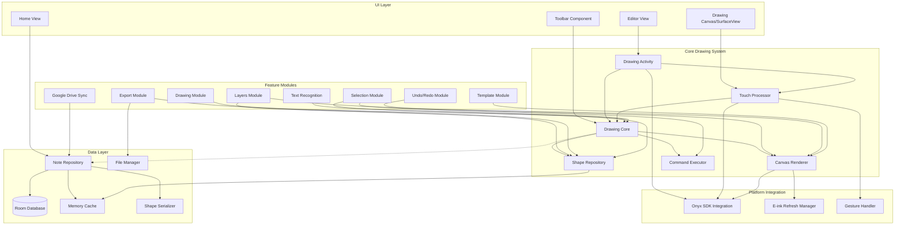
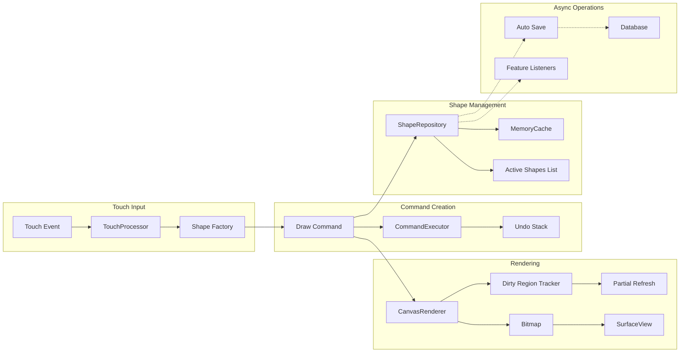
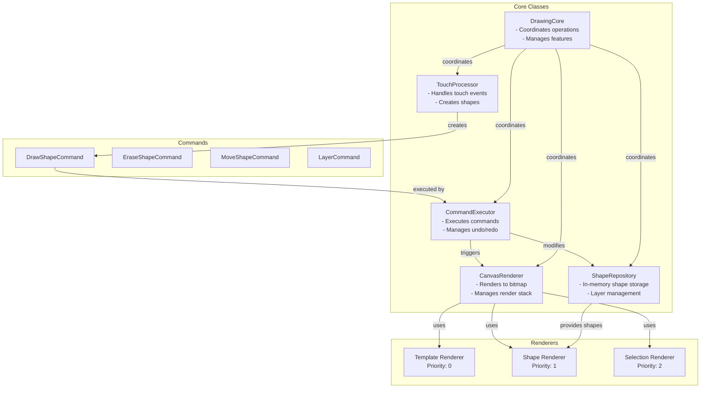
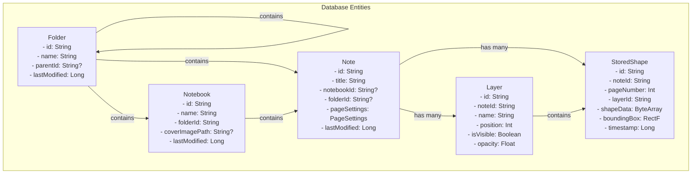

# Note-Taking Application Architecture Plan

## Overview

This document outlines the architecture for a handwritten note-taking application optimized for Onyx e-ink tablets. The architecture prioritizes performance for real-time drawing while maintaining clean separation of concerns and extensibility.

## Core Architecture Principles

1. **Performance First**: Direct calls for critical paths (drawing, touch handling)
2. **Modular Design**: Feature modules that can be added/removed without affecting core
3. **Clean Separation**: Clear boundaries between UI, business logic, and data layers
4. **Memory Efficient**: Object pooling and careful memory management for smooth drawing
5. **LLM-Friendly**: Well-organized packages that minimize context needed for changes

## High-Level Architecture



## Drawing Operation Flow



## Class Interactions



## Database Schema



## Package Structure

```
com.wyldsoft.notes/
├── core/                     # Core business logic
│   ├── drawing/             # Hot path - drawing operations
│   │   ├── DrawingCore.kt
│   │   ├── TouchProcessor.kt
│   │   └── ShapeFactory.kt
│   ├── rendering/           # Rendering system
│   │   ├── CanvasRenderer.kt
│   │   ├── RenderStack.kt
│   │   └── DirtyRegionTracker.kt
│   ├── commands/            # Command pattern
│   │   ├── CommandExecutor.kt
│   │   ├── DrawCommand.kt
│   │   └── CommandPool.kt
│   └── repository/          # In-memory repositories
│       ├── ShapeRepository.kt
│       └── LayerManager.kt
│
├── features/                # Feature modules
│   ├── essential/          # Always loaded
│   │   ├── drawing/
│   │   ├── eraser/
│   │   └── undo/
│   └── optional/           # Loaded on demand
│       ├── selection/
│       ├── layers/
│       ├── templates/
│       ├── export/
│       ├── sync/
│       └── mlkit/
│
├── data/                    # Data persistence
│   ├── database/           # Room entities and DAOs
│   │   ├── entities/
│   │   ├── dao/
│   │   └── AppDatabase.kt
│   ├── repository/         # Repository implementations
│   ├── serialization/      # Shape serialization
│   └── cache/             # Memory caching
│
├── ui/                      # UI Layer
│   ├── home/               # Home screen
│   ├── editor/             # Editor screen
│   ├── components/         # Shared components
│   └── theme/             # Theming
│
├── platform/               # Platform-specific code
│   ├── sdk/               # SDK integration
│   │   ├── DrawingActivity.kt
│   │   └── onyx/
│   ├── gestures/          # Gesture handling
│   └── refresh/           # E-ink refresh management
│
└── utils/                  # Utilities
    ├── extensions/
    ├── performance/
    └── logging/
```

## Key Design Patterns

### 1. Command Pattern for Undo/Redo
```kotlin
interface DrawCommand {
    fun execute()
    fun undo()
    fun canMergeWith(other: DrawCommand): Boolean = false
}

class DrawShapeCommand(
    private val shape: Shape,
    private val repository: ShapeRepository,
    private val renderer: CanvasRenderer
) : DrawCommand {
    override fun execute() {
        repository.addShape(shape)
        renderer.requestRender()
    }
    
    override fun undo() {
        repository.removeShape(shape.id)
        renderer.requestRender()
    }
}
```

### 2. Feature Module Pattern
```kotlin
interface FeatureModule {
    fun registerWith(editor: EditorCore)
    fun cleanup()
}

class SelectionModule : FeatureModule {
    override fun registerWith(editor: EditorCore) {
        editor.gestureHandler.addGestureRecognizer(
            LassoGestureRecognizer { path ->
                handleLassoComplete(path)
            }
        )
    }
}
```

### 3. Render Stack Pattern
```kotlin
abstract class ObjectRenderer(val priority: Int) {
    abstract fun render(canvas: Canvas)
    open fun shouldRender(): Boolean = true
}

class RenderStackManager {
    private val renderers = sortedSetOf<ObjectRenderer>(
        compareBy { it.priority }
    )
    
    fun render(canvas: Canvas) {
        renderers.forEach { 
            if (it.shouldRender()) {
                it.render(canvas)
            }
        }
    }
}
```

## Performance Optimizations

1. **Direct Method Calls**: No event bus for critical paths
2. **Object Pooling**: Reuse shapes and commands to reduce GC
3. **Dirty Region Tracking**: Only refresh changed areas
4. **Batch Operations**: Group database writes
5. **Async Operations**: Non-critical features run in background
6. **Memory Cache**: LRU cache for frequently accessed data

## Feature Implementation Guidelines

### Adding a New Feature

1. Create a feature module in `features/optional/`
2. Implement the `FeatureModule` interface
3. Register gesture recognizers or event listeners
4. Use `DrawCommand` for any undoable operations
5. Add renderers to the render stack if needed
6. Keep feature-specific code isolated in the module

### Example: Adding Lasso Selection

```kotlin
class SelectionModule : FeatureModule {
    private lateinit var selectionManager: SelectionManager
    private lateinit var selectionRenderer: SelectionRenderer
    
    override fun registerWith(editor: EditorCore) {
        // Register gesture
        editor.gestureHandler.addGestureRecognizer(
            LassoGestureRecognizer { path ->
                val selected = findShapesInPath(path)
                selectionManager.setSelection(selected)
                editor.renderManager.addRenderer(selectionRenderer, priority = 100)
            }
        )
        
        // Register toolbar action
        editor.toolbar.addAction(
            SelectionAction { 
                editor.touchProcessor.setMode(TouchMode.SELECTION)
            }
        )
    }
}
```

## Future Considerations

1. **Multi-device Support**: Abstract SDK layer allows easy addition of other stylus devices
2. **Collaboration**: Architecture supports adding real-time sync later
3. **Plugin System**: Feature modules can be loaded dynamically
4. **Performance Monitoring**: Add metrics to track frame times
5. **Testing**: Clean interfaces make unit testing straightforward

## Summary

This architecture provides:
- **High performance** for drawing operations
- **Clean separation** of concerns
- **Easy feature addition** through modules
- **LLM-friendly** organization
- **Scalable** data management
- **Platform agnostic** core logic